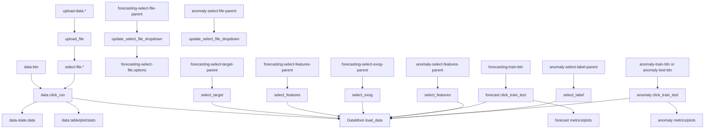

# Merlion Dashboard Callback Flow (by callback id)

This document summarizes the Dash callback call flow used by the Merlion dashboard server.

Relevant source files:

- `merlion/dashboard/server.py`
- `merlion/dashboard/callbacks/data.py`
- `merlion/dashboard/callbacks/forecast.py`
- `merlion/dashboard/callbacks/anomaly.py`
- `merlion/dashboard/models/utils.py`

---

## 1) Server wiring

- `server = app.server` in `merlion/dashboard/server.py`
- Callback modules are imported in `merlion/dashboard/server.py`:
  - `from merlion.dashboard.callbacks import data`
  - `from merlion.dashboard.callbacks import forecast`
  - `from merlion.dashboard.callbacks import anomaly`

This import side-effect registers all Dash callbacks.

---

## 2) Data tab flow

### A. Upload and file selector

- Inputs: `upload-data.filename`, `upload-data.contents`
- Callback: `upload_file(...)`
- Outputs:
  - `select-file.options`
  - `select-file.value`

### B. Load and analyze data

- Input: `data-btn.n_clicks`
- Callback: `click_run(btn_click, modal_close, filename, data)`
- State:
  - `select-file.value`
  - `data-state.data`
- Main load call:
  - `DataAnalyzer().load_data(file_path)`
- Outputs:
  - `data-stats-table.children`
  - `data-state.data`
  - `data-table.children`
  - `data-plots.children`
  - `data-exception-modal.is_open`
  - `data-exception-modal-content.children`
- Cancel trigger: `data-cancel-btn.n_clicks`

### C. Metric detail selection

- Input: `select-column-parent.n_clicks`
- Callback: `update_metric_dropdown(...)`
- Output: `select-column.options`

- Input: `select-column.value`
- Callback: `update_metric_table(...)`
- Output: `metric-stats-table.children`

### D. Download flow

- Input: `data-download-parent.n_clicks`
- Callback: `select_download_parent(...)`
- Output: `data-download.options`

- Input: `data-download-btn.n_clicks`
- Callback: `click_run(btn_click, modal_close, model)`
- Output:
  - `download-data.data` (via `dcc.send_file`)
  - `data-download-exception-modal.is_open`
  - `data-download-exception-modal-content.children`

---

## 3) Forecast tab flow

### A. File and column selection chain

- Input: `forecasting-select-file-parent.n_clicks`
  - Callback: `update_select_file_dropdown(...)`
  - Output: `forecasting-select-file.options`

- Input: `forecasting-select-file.value`
  - Callback: `update_select_file_dropdown(...)`
  - Outputs reset:
    - `forecasting-select-target.value`
    - `forecasting-select-features.value`
    - `forecasting-select-exog.value`

- Input: `forecasting-select-target-parent.n_clicks`
  - Callback: `select_target(...)`
  - Output: `forecasting-select-target.options`

- Input: `forecasting-select-features-parent.n_clicks`
  - Callback: `select_features(...)`
  - Output: `forecasting-select-features.options`

- Input: `forecasting-select-exog-parent.n_clicks`
  - Callback: `select_exog(...)`
  - Output: `forecasting-select-exog.options`

Note: the target/features/exog option callbacks use `ForecastModel().load_data(file_path, nrows=2)` for schema inspection.

### B. Algorithm and params

- Input: `forecasting-select-algorithm-parent.n_clicks`
  - Callback: `select_algorithm_parent(...)`
  - Output: `forecasting-select-algorithm.options`

- Input: `forecasting-select-algorithm.value`
  - Callback: `select_algorithm(...)`
  - Output: `forecasting-param-table.children`

### C. Train/test execution

- Input: `forecasting-train-btn.n_clicks`
- Callback: `click_train_test(...)`
- State includes:
  - file/target/features/exog/algorithm/params/train split/test file/file mode
- Main load calls:
  - `ForecastModel().load_data(train_file)`
  - `ForecastModel().load_data(test_file)` (when split mode uses separate test file)
- Outputs:
  - `forecasting-training-metrics.children`
  - `forecasting-test-metrics.children`
  - `forecasting-plots.children`
  - `forecasting-exception-modal.is_open`
  - `forecasting-exception-modal-content.children`
- Progress outputs:
  - `forecasting-progressbar.value`
  - `forecasting-progressbar.max`
- Cancel trigger: `forecasting-cancel-btn.n_clicks`

### D. File mode UI toggle

- Input: `forecasting-file-radio.value`
- Callback: `set_file_mode(...)`
- Outputs:
  - `forecasting-slider-collapse.is_open`
  - `forecasting-test-file-collapse.is_open`

---

## 4) Anomaly tab flow

### A. File and column/label selection chain

- Input: `anomaly-select-file-parent.n_clicks`
  - Callback: `update_select_file_dropdown(...)`
  - Output: `anomaly-select-file.options`

- Input: `anomaly-select-file.value`
  - Callback: `update_select_file_dropdown(...)`
  - Outputs reset:
    - `anomaly-select-features.value`
    - `anomaly-select-label.value`

- Input: `anomaly-select-test-file-parent.n_clicks`
  - Callback: `update_select_test_file_dropdown(...)`
  - Output: `anomaly-select-test-file.options`

- Input: `anomaly-select-features-parent.n_clicks`
  - Callback: `select_features(...)`
  - Output: `anomaly-select-features.options`

- Input: `anomaly-select-label-parent.n_clicks`
  - Callback: `select_label(...)`
  - Output: `anomaly-select-label.options`

Note: features/label option callbacks use `AnomalyModel().load_data(file_path, nrows=2)` for schema inspection.

### B. Algorithm/threshold and params

- Input: `anomaly-select-algorithm-parent.n_clicks`
  - Callback: `select_algorithm_parent(...)`
  - Output: `anomaly-select-algorithm.options`

- Input: `anomaly-select-algorithm.value`
  - Callback: `select_algorithm(...)`
  - Output: `anomaly-param-table.children`

- Input: `anomaly-select-threshold-parent.n_clicks`
  - Callback: `select_threshold_parent(...)`
  - Output: `anomaly-select-threshold.options`

- Input: `anomaly-select-threshold.value`
  - Callback: `select_threshold(...)`
  - Output: `anomaly-threshold-param-table.children`

### C. Train/test execution

- Inputs:
  - `anomaly-train-btn.n_clicks`
  - `anomaly-test-btn.n_clicks`
- Callback: `click_train_test(...)`
- State includes:
  - train/test file/features/algorithm/label/params/threshold/split/train metrics/file mode
- Main load calls:
  - `AnomalyModel().load_data(train_file)`
  - `AnomalyModel().load_data(test_file)`
- Outputs:
  - `anomaly-training-metrics.children`
  - `anomaly-test-metrics.children`
  - `anomaly-plots.children`
  - `anomaly-exception-modal.is_open`
  - `anomaly-exception-modal-content.children`
- Progress outputs:
  - `anomaly-progressbar.value`
  - `anomaly-progressbar.max`
- Cancel trigger: `anomaly-cancel-btn.n_clicks`

### D. File mode UI toggle

- Input: `anomaly-file-radio.value`
- Callback: `set_file_mode(...)`
- Outputs:
  - `anomaly-slider-collapse.is_open`
  - `anomaly-test-file-collapse.is_open`

---

## 5) Shared data-loading implementation

Actual file read logic is centralized in:

- `DataMixin.load_data(file_path, nrows=None)` in `merlion/dashboard/models/utils.py`

Used by:

- `DataAnalyzer` (Data tab)
- `ForecastModel` (Forecast tab)
- `AnomalyModel` (Anomaly tab)

---

## 6) Quick visual map

